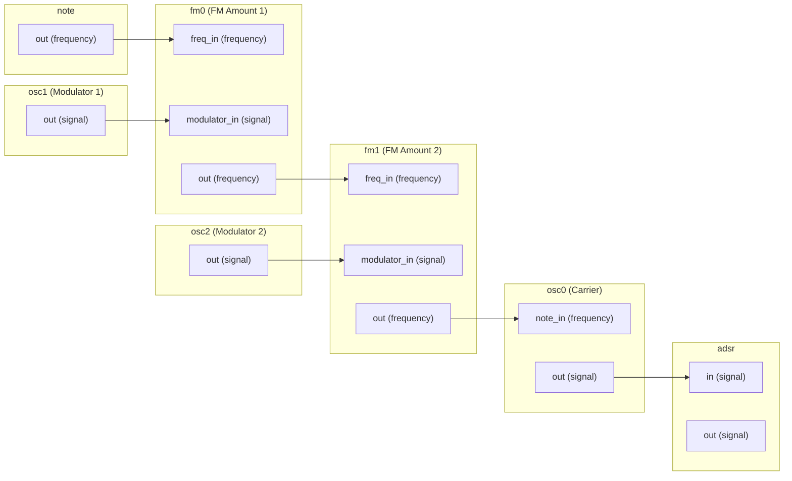
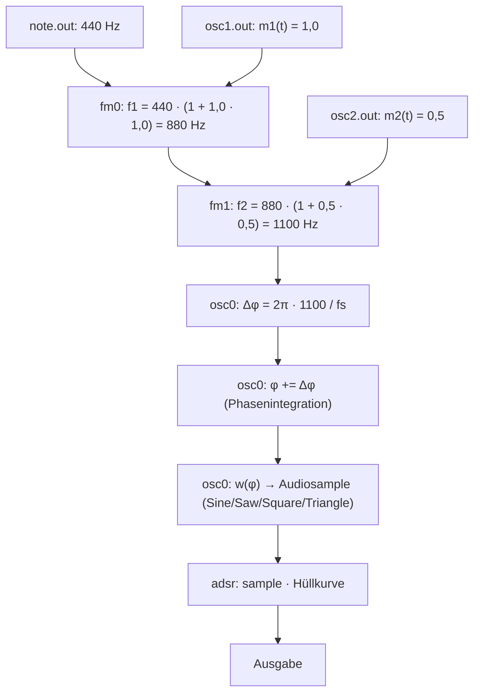

# Frequenz-Routing durch die FM-Verkettung

SmolFM trennt streng zwischen zwei Signalwelten, die im Graph über den
Port-Typ (`PortType`) typisiert sind:

| PortType    | Bedeutung                        | Einheit        |
|-------------|----------------------------------|----------------|
| `frequency` | Momentanfrequenz (Steuersignal)  | Hertz          |
| `signal`    | Audiosample (Amplitude)          | −1.0 … +1.0    |

Der entscheidende Architekturpunkt: **FM-Stufen transportieren keine
Audiosignale, sondern Hertz.** Erst der Oszillator am Ende der Kette wandelt
die (modulierte) Frequenz in Klang um.

## Die FM-Stufe

Jede `FMModulationProcessor`-Stufe ist zustandslos und rechnet pro Sample
nur:

$$f_{out} = f_{in} \cdot \bigl(1 + a \cdot m(t)\bigr)$$

- $f_{in}$: eingehende Carrier-Frequenz (von `note.out` oder einer
  vorgeschalteten FM-Stufe)
- $m(t)$: Modulator-Audiosample $\in [-1, 1]$
- $a$: FM-Index (Parameter `fmAmountN`)
- $f_{out}$: Momentanfrequenz in Hertz

Eigenschaften:

- **Transparent im Leerlauf**: `amount = 0` oder kein Modulator verdrahtet
  → $f_{out} = f_{in}$ exakt. Eine ungenutzte Stufe kostet nichts und
  verändert nichts.
- **Proportionale Abweichung**: Die Frequenzabweichung skaliert mit der
  Carrier-Frequenz. Dadurch ist der Modulationsindex — und damit die
  Klangfarbe — auf jeder Taste identisch.
- **Through-Zero-fähig**: $f_{out}$ darf negativ werden; die Phase des
  Oszillators läuft dann rückwärts (`SimpleOscillator` wrappt per `fmod`).

## Verkettung: Frequenzen fließen, Modulatoren speisen ein

### So sieht die Verdrahtung in der UI aus

Auf dem Canvas entsprechen die Boxen den Prozessor-Knoten. Jede Box hat
beschriftete Pins; eine Wire verbindet immer einen Output-Pin mit einem
Input-Pin. Die Wire-Farbe folgt dem Port-Typ (`frequency` vs. `signal`):



Wichtig daran: Die FM-Boxen bilden eine **Hertz-Kaskade** auf der
`frequency`-Ebene (obere Wire-Kette), während die Modulator-Oszillatoren nur
von der Seite als `signal` einspeisen. Der Carrier-Oszillator hängt **am
Ende** der Kaskade, nicht dazwischen.

### So läuft die Prozessierung pro Sample ab

Dieselbe Verdrahtung als Datenfluss mit konkreten Werten
(Grundton 440 Hz, $a_0 = 1$, $a_1 = 0{,}5$):



Die Zusammenhänge, die man hier sieht:

- **Frequenzen multiplizieren sich**: $f_2 = 440 \cdot (1 + a_0 m_1)(1 + a_1 m_2)$.
  Jede Stufe biegt relativ zur bereits modulierten Frequenz — nicht zur
  Grundfrequenz.
- **Nur ein Oszillator rendert**: Erst `osc0` macht aus Hertz eine Phase und
  aus der Phase Klang. Die Modulator-Oszillatoren liefern nur $m(t)$.
- **Die Hüllkurve kommt zuletzt**: ADSR skaliert die Amplitude, nie die
  Frequenz.

Schritt für Schritt pro Sample (440 Hz Grundton, beide Amounts aktiv):

1. `note` gibt **440 Hz** aus.
2. `fm0` liest 440 Hz an `freq_in` und $m_1(t)$ an `modulator_in`:
   $$f_1 = 440 \cdot (1 + a_0 \cdot m_1(t))$$
3. `fm1` liest $f_1$ an `freq_in` und $m_2(t)$ an `modulator_in`:
   $$f_2 = f_1 \cdot (1 + a_1 \cdot m_2(t))
         = 440 \cdot (1 + a_0 m_1)(1 + a_1 m_2)$$
4. `osc0` empfängt $f_2$ an seinem `note_in`-Port und setzt daraus das
   Phase-Increment:
   $$\Delta\varphi = \frac{2\pi \cdot f_2}{f_s}$$
5. `osc0` integriert: $\varphi_{n+1} = \varphi_n + \Delta\varphi$ und rendert
   die gewählte Wellenform $w(\varphi)$ — Sinus, Saw, Square, Triangle.

## Warum das echte FM ist (und kein PM-Hack)

Bei FM gilt: Phase ist das Integral der Momentanfrequenz.

$$\varphi(t) = 2\pi \int f(t)\,dt$$

Da die Modulation **vor** der Phasenintegration passiert (im Hz-Wert), wird
der Modulator mathematisch integriert — das ist exakt die Definition von
Frequenzmodulation. Bei Phasenmodulation würde der Modulator *nach* der
Integration als Offset $\varphi + a\cdot m(t)$ addiert, was einem
differenzierten Modulator entspricht.

Nebeneffekt: Weil die FM-Stufe die Wellenform nie sieht, funktioniert
**jede** Carrier-Wellenform — auch eine spätere Wavetable — ohne eine Zeile
Code im FM-Baustein zu ändern.

## Sample-Genauigkeit und Ausführungsreihenfolge

`SignalGraph` verarbeitet die Prozessoren in **Einfügereihenfolge**
(Fabrikreihenfolge in `SynthVoice::buildGraph()`):

```
note → osc0..osc7 → fm0..fm3 → adsr
```

Jeder Prozessor liest die gecachten Output-Samples seiner Quellen aus dem
**aktuellen Tick**. Da die Oszillatoren *vor* den FM-Stufen laufen, lesen die
FM-Stufen die frischen Modulator-Samples desselben Samples. Einzige Ausnahme:
Ein Oszillator, der von einer FM-Stufe gespeist wird (z. B. `osc0` hinter
`fm0`), liest deren Ausgang erst **einen Sample später**. Bei 48 kHz ist das
eine konstante Latenz von ~20 µs — für Frequenzsteuerung unhörbar, aber der
Vollständigkeit halber dokumentiert.

## Parameterfluss

| Parameter        | Herkunft                        | Weg in den Graph                                   |
|------------------|----------------------------------|----------------------------------------------------|
| `oscNFrequency`  | APVTS (Slider)                   | Fallback, wenn `note_in` unverbunden ist           |
| `note.out`       | MIDI-Note → Hz (`NoteProcessor`) | treibt `fm.freq_in` oder direkt `osc.note_in`      |
| `fmAmountN`      | APVTS (Slider)                   | Atomarer Pointer im `FMModulationProcessor`        |
| `oscNWaveform`   | APVTS (Choice)                   | Wellenform des rendernden Oszillators              |

Alle Parameter werden pro Sample als `std::atomic<float>` gelesen — die UI
kann jederzeit umschalten, ohne den Audio-Thread zu blockieren.

## Verifikation

`SmolFM_GraphTests` enthält den Test **Chained FM stages**:

- **Transparenz**: `note → fm0 → fm1` mit beiden Amounts auf 0 liefert exakt
  440.000 Hz am Ausgang von `fm1`.
- **Deviation**: $a_0 = 1$, 2-Hz-Sinus-Modulator → die Momentanfrequenz
  schwingt exakt zwischen 0 Hz und 880 Hz ($= 440 \cdot (1 \pm 1)$), durch
  `fm1` unverändert weitergereicht.
